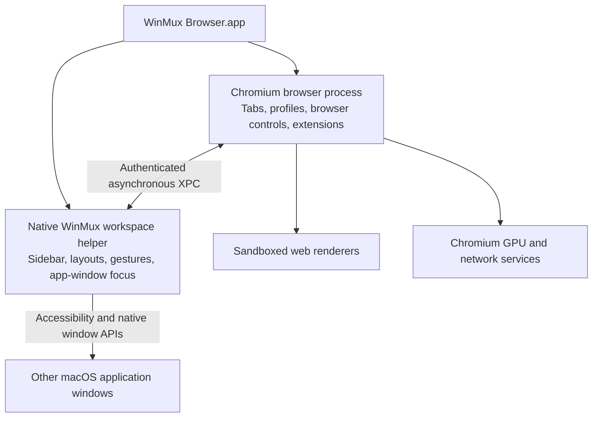

# WinMux Browser: a Chromium browser and native window manager

## 1. Product direction and release requirements

Build one macOS product where websites and native app windows share WinMux’s sidebar, Spaces, Groups, tab stacks, and split layouts.

The first release is a **private daily driver for you**, designed around **100 browser tabs and 20 native app windows**. Performance is a release requirement from the first prototype.

### Decisions already made

| Area | Decision |
|---|---|
| Browser foundation | Full Chromium browser codebase, with a controlled downstream patch set |
| First audience | Your own daily use, with public distribution possible later |
| Switching | Immediate content switching; no screenshot-based transition |
| Resource policy | Keep recent tabs ready; reclaim resources from older eligible tabs |
| Accounts | Shared default profile, with optional Work/Personal profiles |
| Ad blocking | Built in from the first daily-driver release |
| Required extensions | 1Password, Readwise, Cosmos |
| Optional extension | Minimal Theme for Twitter |
| Search | Kagi by default |
| External links | Open in the current Space using that Space’s default profile |
| Protected streaming | Another browser is an acceptable initial fallback |
| Primary benchmark machine | Your M3 Pro MacBook Pro with 36 GB RAM |
| Initial platform qualification | Apple silicon, your current macOS 27.0 installation |

Public launch, Intel support, cross-device sync, mobile apps, and a proprietary streaming integration are later milestones.

### What “finished” means

You can spend a normal working day inside the product and:

- Move between websites and native windows through the same controls.
- Mix them in tab stacks and splits.
- Use your essential extensions without workarounds.
- Browse with effective built-in ad blocking.
- Switch Spaces without losing account context or active work.
- Restart without losing browser tabs or workspace organization.
- Keep working in native apps when a renderer or the browser fails.
- Meet the performance gates below with extensions and blocking enabled.

The performance numbers in this plan are **proposed acceptance thresholds**, not claims about an existing implementation.

### Starting point

The inspected WinMux checkout already provides native window management, sidebar organization, tab groups, gestures, event-invalidated window caches, background title lookup, and serialized session writing.

The main structural constraint is that its layout, focus, sidebar actions, and restoration currently assume a leaf is a macOS window identified by a numeric window ID. Browser tabs require a persistent identity independent of any native window or renderer.

The current screenshot-based flip path also performs captures before requesting focus. The new default switching path will bypass it completely.

---

## 2. Architecture and implementation boundaries

### 2.1 One application, separate browser and workspace processes

Package a Chromium-based foreground application with an embedded native workspace helper.

**Chromium owns:**

- Browser windows and web content.
- Profiles, cookies, storage, history, and browser sessions.
- Navigation, permissions, downloads, and developer tools.
- Extension installation, execution, UI, and updates.
- Browser-process recovery and tab resource management.
- The built-in blocking engine.

**The native workspace helper owns:**

- Spaces, Groups, mixed tab stacks, and split geometry.
- The shared sidebar and workspace settings.
- Native app-window discovery, placement, and focus.
- Global workspace shortcuts and gestures.
- Workspace persistence and browser-tab placement.

The workspace helper remains independent of the browser’s event loop. A blocked browser must not stall switching between two native applications.

Use Apple’s `SMAppService` to manage the bundled helper and asynchronous `NSXPCConnection` communication. Register a per-user LaunchAgent; no root daemon is needed. [Apple helper-service documentation](https://sosumi.ai/documentation/servicemanagement/smappservice), [XPC documentation](https://sosumi.ai/documentation/foundation/nsxpcconnection)

### 2.2 Preserve Chromium’s browser machinery

Start from a pinned stable Chromium revision and retain its profile, browser-window, tab, and `WebContents` ownership model. Those are separate concepts in Chromium and should remain separate in our integration. [Chromium browser design principles](https://chromium.googlesource.com/chromium/src/+/main/docs/chrome_browser_design_principles.md)

Use Chromium’s existing compiled browser UI for:

- Address field and navigation controls.
- Site identity and permission indicators.
- Extension buttons, popups, and side panels.
- Download controls.
- Browser dialogs and developer tools.

Restyle this conservatively. Reimplementing these controls in SwiftUI would add compatibility and synchronization work without establishing a performance benefit.

Hide Chromium’s normal tab strip while the workspace helper is connected. WinMux becomes the visible tab organizer.

If the helper disconnects, reveal a conventional browser tab strip so browsing remains usable. Reconnect and reconcile before returning to the unified presentation.

Maintain the fork as a pinned upstream checkout plus separately owned integration modules and small patches. Record the Chromium revision, toolchain, native-helper revision, Rust dependencies, and build configuration in a reproducible build manifest.

### 2.3 Introduce a shared item model

Add a typed workspace item abstraction instead of assigning fake macOS window IDs to browser tabs.

| Type | Responsibility |
|---|---|
| `SurfaceID` | Stable identity for a native-window item or browser-tab item |
| `NativeWindowBinding` | Current PID, process launch identity, macOS window ID, and boot identity |
| `BrowserTabID` | Persistent UUID surviving renderer replacement, unloading, and browser restart |
| `BrowserProfileID` | Identity of the owning Chromium profile |
| `BrowserHostBinding` | Runtime mapping between a layout container, profile, Chromium window, and macOS window ID |
| `SurfaceCapabilities` | Supported actions, such as close, reload, navigate, duplicate, or mute |
| `FocusIntent` | Target item, generation, cause, and pending/confirmed/failed status |

Refactor the shared tree, traversal, focus, drag/drop, and sidebar interfaces to operate on `SurfaceID`.

Keep native operations behind a native-window adapter and browser operations behind a browser adapter. Layout code decides where an item belongs; adapters perform the appropriate operation.

Use capabilities to control menus. A native document does not receive Reload, and a website does not receive unsupported native document actions.

Browser-owned host windows must be excluded from ordinary AX discovery as independent items. Register them through the authenticated bridge before presenting them. Classify browser popups, extension UI, developer tools, and picture-in-picture windows separately to avoid accidental tiling.

### 2.4 Render browser content directly

Web content stays inside Chromium-owned native windows and its existing GPU rendering path.

Use one browser host per **materialized web-bearing tab stack and profile**, created lazily and reused for that stack’s tabs. A split showing two websites requires two visible hosts; background tabs within a stack do not each receive their own native window.

For a mixed stack:

- Selecting a web item activates its Chromium tab and presents its host.
- Selecting a native item hides the browser host and focuses the native window.
- Reordering changes the shared stack order.
- Moving a web item between containers transfers the actual tab through Chromium’s supported ownership path.
- Moving between displays updates geometry, backing scale, and visibility.

Explicitly propagate hidden/visible state to Chromium. Parking a window offscreen is insufficient as a browser resource-management policy.

There is no continuous screenshot capture, bitmap streaming, or custom compositor for browser content.

### 2.5 Keep focus and layout communication bounded

Use one long-lived authenticated XPC connection with an Objective-C-compatible bridge implemented in Swift and Objective-C++.

The minimum interface supports:

| Direction | Operations |
|---|---|
| Workspace → browser | Create, activate, close, move, set host geometry/visibility, request inventory |
| Browser → workspace | Tab created/closed/changed, host registered, activation result, profile inventory, recovery state |
| Both | Protocol negotiation, lifecycle notifications, revision acknowledgment |

Every connection has an epoch; mutations carry operation IDs and revisions. Focus requests also carry a monotonically increasing generation.

Rules:

- Newer focus intent supersedes older pending focus work.
- Delayed acknowledgments cannot change the selected item back.
- Repeated create/close messages are idempotent.
- Geometry updates coalesce to the newest bounds.
- Metadata updates coalesce by changed item.
- Full inventories occur at connection/recovery, not on every interaction.
- No synchronous XPC calls on either UI thread.
- No web-page JavaScript API exposes workspace control.
- Extensions see actual browser tabs through browser APIs; native windows are not fabricated as `chrome.tabs`.

Sidebar selection can update immediately, but focus success is reported only when the destination has actually been activated. Keep macOS responsible for input delivery; do not buffer and replay arbitrary user keystrokes.

### 2.6 Preserve CLI and automation compatibility

Retain current numeric window-ID commands for native windows.

Add:

- `surface list`
- `surface focus`
- `surface move`
- `surface close`

New commands accept typed surface IDs. Extend the existing agent layout interface with a browser-tab reference while retaining existing native-window references.

Expose metadata and lifecycle state through these interfaces. Do not add page-content extraction or browser scripting to the workspace-control interface in v1.

### 2.7 Split persistence by ownership

**Chromium persists:** profiles, browser history, tab navigation/session state, extension data, and browser-tab UUIDs.

**WinMux persists:** Spaces, Groups, layout trees, selected items, profile defaults, native-window restoration bindings, and references to browser-tab UUIDs.

Extend Chromium’s session serialization with namespaced tab UUID metadata. Do not use renderer IDs, extension tab IDs, or array positions as durable identity.

Introduce a new workspace snapshot version with explicit readers for the existing format. Import the current native-only layout into the new item model.

Persistence behavior:

- Use the existing serialized background-writer pattern.
- Coalesce ordinary layout checkpoints with a maximum one-second delay.
- Flush on orderly quit.
- Persist browser close tombstones so stale workspace snapshots cannot reopen intentionally closed tabs.
- On recovery, Chromium is authoritative for which browser tabs exist; WinMux is authoritative for placement.
- Put browser tabs with missing placement into a visible Recovered group.
- Restore browser records lazily, loading visible tabs first.
- Never persist private-browsing tabs in workspace snapshots or diagnostics.

Native-window restoration continues to require matching process and boot identity. After a reboot, unresolved native items become reconnectable placeholders; v1 does not promise to reopen arbitrary application documents.

---

## 3. Browser behavior and essential integrations

### 3.1 Unified workspace interaction

Keep the existing visible hierarchy:

**Spaces → Groups → mixed tab stacks and splits**

Websites and app windows support the same organization actions:

- Select.
- Drag to reorder.
- Move between Groups or Spaces.
- Stack together.
- Split beside another item.
- Find through workspace search.

Each website appears once in the workspace interface.

The browser toolbar belongs to the visible web pane. Switching to a native app leaves that app’s existing controls and menu behavior intact.

Browser shortcuts—such as Command-L, Command-T, Command-R, and Command-W—apply while a browser window is active. Existing global WinMux navigation operates across both item types. Native app shortcuts retain their current behavior.

Closing a native document uses the application’s normal close/save flow. Closing a browser tab honors Chromium’s before-unload handling. Do not remove either item permanently until closure is confirmed.

### 3.2 Profiles and link routing

Create one Default profile initially. Users can add named profiles and assign a default profile to each Space.

Rules:

- Space profile defaults govern newly created tabs.
- Existing tabs retain their owning profile.
- Dragging a tab into another Space preserves its login/session.
- Show a profile badge when a tab differs from its Space’s default.
- “Open in another profile” creates a new tab in that profile; it does not transfer cookies or silently destroy the original session.
- Private browsing uses Chromium’s off-the-record profile behavior and is visibly marked.

External HTTP/HTTPS links open in the current Group of the focused Space using that Space’s default profile. If there is no suitable selected stack, create one in that Group.

Links originating inside a browser tab inherit that tab’s profile. Authentication popups preserve their opener and browser security behavior.

Offer **Open in Another Browser** for protected streaming and exceptional compatibility cases.

### 3.3 Extensions are an early release gate

Use Chromium’s normal extension installation, permissions, updates, background workers, context menus, and native-messaging machinery.

Install the official extensions through the normal browser flow. Do not repackage them or implement substitute integrations.

| Extension | Required acceptance scenarios |
|---|---|
| **1Password** | Install, sign in, unlock through the Mac app/Touch ID, fill, save/update credentials, generate passwords, use passkeys, survive lock/unlock and browser restart |
| **Readwise** | Authenticate, save rendered articles, highlight, use toolbar and shortcut actions, save from authenticated sites, retain pending saves across ordinary navigation |
| **Cosmos** | Authenticate, save pages/images, choose a collection, use supported context-menu actions, preserve sessions across restart |
| **Minimal Twitter** | Apply settings and styling across navigation, reload, and suspension; optional release status |

Test each required extension in Default and an additional profile, with blocking enabled, and after an extension update.

1Password documents a way to connect additional Mac browsers, but that depends on a functioning browser extension. Validate the signed top-level application through that supported flow during the first milestone. [1Password additional-browser support](https://support.1password.com/additional-browsers/)

Some extension authentication APIs depend on Google services unavailable to arbitrary Chromium derivatives. Required-extension login is therefore a demonstrated gate, not an assumption based on using Chromium. [Chromium derivative API restrictions](https://www.chromium.org/developers/how-tos/api-keys/)

If a required extension fails, resolve that incompatibility before proceeding toward daily-driver qualification.

### 3.4 Built-in ad blocking

Use **Brave’s `adblock-rust`** as the maintained filtering engine. It already supports network blocking, cosmetic filtering, and resource replacements. Keep it behind a small native interface with pinned dependencies. [Engine documentation](https://github.com/brave/adblock-rust)

The initial implementation includes:

- EasyList and EasyPrivacy.
- Network request blocking and exception rules.
- Cosmetic filtering, including dynamically inserted content.
- Engine-supported resource replacements with an explicit bundled resource set.
- Per-site enable/disable.
- A compact toolbar control with blocked-request count.
- Filter-update status and recovery to the last valid ruleset.

Integration requirements:

- Evaluate requests inside the browser’s native request-interception path.
- Keep filtering outside Swift/XPC and outside browser UI-thread work.
- Cover document/subresource requests, redirects, worker requests, and WebSocket handshakes where applicable.
- Use trusted browser-provided initiator and top-level-site context.
- Keep profile/site exceptions separate from the shared immutable ruleset.
- Apply cosmetic rules in the relevant document/frame.
- Batch dynamic DOM processing; no perpetual full-document rescanning.
- Permit only bundled, versioned replacement/scriptlet resources. Filter lists cannot supply arbitrary privileged code.

Compile updated rules on a background sequence and atomically replace the active ruleset. Retain the previous valid version if downloading, validation, or compilation fails.

Bundle a usable initial ruleset. Check for updates approximately daily with jitter and backoff; filter refresh never blocks launch or navigation.

Keep the network integration narrow and measure every extra queue or process hop. Chromium explicitly identifies those hops as latency risks in its network service. [Network-service design](https://chromium.googlesource.com/chromium/src/+/main/services/network/README.md)

Track licenses and attribution for the engine, lists, and replacement resources in the distribution manifest.

### 3.5 Kagi and everyday browsing

Configure Kagi as the default search provider using its documented search endpoint. Search authentication remains in the active browser profile. Keep search suggestions optional and off initially. [Kagi configuration](https://help.kagi.com/kagi/getting-started/setting-default.html)

Before daily-driver qualification, verify:

- Bookmarks and history.
- Downloads, uploads, drag/drop, and file pickers.
- PDF viewing and printing.
- Clipboard, find-in-page, zoom, spelling, and accessibility.
- Ordinary video/audio, picture-in-picture, and hardware decoding.
- Camera, microphone, screen sharing, and video calls.
- Notifications and external application links.
- Developer tools and localhost development.
- Certificate errors and permission prompts.
- Login flows for the websites you regularly use.

Use upstream Chromium implementations wherever available. Verify media support in the actual packaged build; codec behavior varies with the build configuration. [Chromium media documentation](https://www.chromium.org/audio-video/)

---

## 4. Performance engineering and verification

### 4.1 Define a reproducible workload

The primary qualification workload is:

- 100 browser tabs across 10 Spaces.
- 20 native app windows.
- Two browser profiles.
- Up to four simultaneously visible web panes.
- 1Password, Readwise, and Cosmos enabled.
- Built-in blocking enabled.
- A mix of articles, GitHub, documentation, dashboards, forms, image-heavy pages, and web applications.

Add separate tests for video playback, video calls, a busy renderer, a stalled native application, and memory pressure.

Use deterministic local fixtures for repeatable timing and live websites for compatibility. Measure optimized signed builds on the same display configuration, power mode, thermal conditions, and OS version.

### 4.2 Acceptance thresholds

| Measurement | Initial release requirement |
|---|---|
| Input → visible selection feedback | p95 within two display frames: ≤16.7 ms at 120 Hz; ≤33.3 ms at 60 Hz |
| Warm web tab → visible, input-ready content | p95 ≤50 ms; p99 ≤100 ms |
| Frozen resident tab → input-ready content | p95 ≤100 ms |
| Native or mixed tab switch | p95 ≤100 ms on responsive test applications |
| Space switch with loaded visible items | p95 ≤150 ms |
| New local blank tab → usable address field | p95 ≤150 ms |
| Workspace search over 500 items | p95 ≤50 ms |
| Continuous sidebar scrolling and divider dragging | Fewer than 1% missed frame deadlines; no product-caused stall over 50 ms |
| Main-thread work introduced per interaction | p95 ≤4 ms per process; no synchronous disk/network work |
| Workspace helper idle CPU | Average ≤0.5% of one CPU core over five settled minutes |
| Whole product idle CPU on settled static fixtures | Average ≤2% of one CPU core |
| Workspace-helper physical footprint | ≤250 MiB with snapshots disabled |
| Integration overhead over matched browser-only control | ≤250 MiB, excluding the separately measured helper |
| Blocking overhead per request | Added latency p95 ≤1 ms; p99 ≤3 ms under the defined concurrent-request fixture |
| Browser benchmark regression | No repeatable regression above 5% against the same Chromium revision with equivalent settings |
| Warm launch → usable workspace UI | p95 ≤1 second |
| Cold launch → usable browser/workspace UI | p95 ≤3 seconds, excluding installation and first-run OS approval |

Website network latency is measured separately. A loading indicator or cached screenshot does not count as input-ready content.

The native-switch target applies to responsive applications. A stalled target application must not block the sidebar or a subsequent switch to a healthy application.

Missing a threshold blocks the milestone. Fix or reduce the responsible feature; do not quietly relax the threshold.

### 4.3 Tab lifetime policy

Use Chromium’s Performance Manager and page lifecycle mechanisms to implement policy. Do not create a separate timer system that fights browser lifecycle decisions. [Performance Manager](https://chromium.googlesource.com/chromium/src/+/main/components/performance_manager/README.md), [Page Lifecycle API](https://developer.chrome.com/docs/web-platform/page-lifecycle-api)

Initial defaults on your 36 GB machine:

| State | Policy |
|---|---|
| Visible | Fully active |
| Recent background | Keep the 12 most recently used eligible background tabs resident and ready |
| Older background | Eligible for freezing after two minutes |
| Long-unused | Eligible for discarding after 15 minutes |
| Memory pressure | Discard eligible least-recently-used tabs earlier |
| Restart restoration | Restore records immediately; load visible tabs first |
| User-selected “Keep active” | Exempt from automatic freezing/discarding |

Use **8 GiB as the initial soft browser-process-tree budget** to trigger earlier reclamation. It is not a promise that arbitrary websites or protected work fit within that amount.

Protect:

- Visible and focused tabs.
- Audio/video playback, calls, capture, and screen sharing.
- Active uploads/download-related page work.
- Tabs with form interaction or before-unload protection.
- Active developer-tool sessions.
- In-flight extension operations that need the page.
- Explicitly exempted tabs.

Treat form interaction conservatively until a full document navigation or explicit user action clears the protection. Preserving work takes precedence over the soft memory budget.

Do not force-stop extension background workers or service workers to meet page-memory targets. Keep Chromium’s normal event-driven scheduling.

### 4.4 Keep common operations small

Required implementation rules:

- Focus requests do not await title lookup, icons, persistence, or global model rebuilds.
- Maintain direct identity maps.
- Publish changed items/containers instead of rebuilding every Space.
- Use lazy sidebar rendering for large sessions.
- Decode favicons off the main thread and bound image caches.
- Coalesce resize and metadata events.
- Cancel obsolete work promptly.
- Keep background work bounded and lower priority than input.
- Avoid polling AX geometry when the existing event-invalidated cache is valid.
- Never reduce sandboxing or site isolation to improve benchmark results.
- Do not keep hidden pages artificially foregrounded to accelerate switching.
- Keep transition screenshots disabled in the initial release.

Startup restores organization before eagerly loading pages. Opening a 100-tab saved session must not launch 100 concurrent navigations.

### 4.5 Measure the user-visible path

Add correlated timestamps/signposts for:

1. Input received.
2. Target resolved.
3. Layout/focus request issued.
4. Native focus or Chromium tab activation confirmed.
5. Content frame presented.
6. Destination ready for input.

Report these separately. IPC acknowledgment, key-window notification, and frame presentation are different events.

Use:

- Native signposts and Instruments for the workspace helper.
- Chromium tracing/Perfetto for browser scheduling and rendering.
- Chromium MemoryInfra for process-tree memory attribution.
- Presentation traces plus screen/high-frame-rate validation for visible transitions.
- A shared interaction ID to connect native and browser measurements.

Do not sum process RSS and call it unique memory usage. Account for shared allocations and report renderer, GPU, browser, and helper contributions separately. [Chromium MemoryInfra](https://chromium.googlesource.com/chromium/src/+/main/docs/memory-infra/README.md)

For percentile claims, collect at least 1,000 scripted interactions across multiple runs. Keep physical trackpad, keyboard, and mouse testing as separate required evidence.

### 4.6 Regression and failure tests

**Model and protocol**

- Mixed layout traversal, reorder, split, close, and focus.
- Browser restart with changed runtime IDs.
- Duplicate messages, stale generations, dropped connections, and inventory reconciliation.
- Profile preservation during moves.
- Migration from the native-only session format.
- No accidental browser-host duplication in AX discovery.

**Browser compatibility**

- All essential extension scenarios.
- Extension updates and background-worker restart.
- OAuth popups, file dialogs, full screen, picture-in-picture, and developer tools.
- Form preservation during freezing/discarding decisions.
- Independent private-profile behavior.
- Ad-block exceptions, redirects, workers, frames, and dynamic cosmetic filtering.

**Performance and durability**

- Rapid repeated and reversed gestures.
- Typing after confirmed focus.
- Opening and closing 1,000 tabs over repeated cycles.
- 500-tab/50-native-window stress sessions.
- Eight-hour mixed-use soak.
- Sleep/wake, lock/unlock, display unplugging, and scale changes.
- Renderer, GPU, browser, and helper crashes.
- Slow disks and failed checkpoint writes.
- No unbounded memory-growth trend after closing/reopening cycles.

Run behavioral tests on every relevant change. Run performance qualification on a dedicated machine, not noisy shared CI.

---

## 5. Delivery sequence, recovery, and maintenance

### Milestone 0 — Baseline and compatibility proof

Deliver:

- An isolated development checkout preserving existing WinMux work.
- A reproducible optimized Chromium build and separately built native helper.
- A signed top-level application with stable alpha bundle identities.
- Authenticated helper communication.
- A minimal direct-rendered browser window.
- Required-extension installation and login results.
- 1Password Mac-app integration.
- Baseline switching, memory, startup, and browser benchmark reports.
- A small built-in-blocking integration proving the request path and cosmetic path.

**Exit gate:** the required extensions function in the signed application, helper packaging works, and the rendering/control architecture shows no fundamental performance blocker.

Do this before the broad WinMux model migration.

### Milestone 1 — Generalize WinMux without changing native behavior

Deliver:

- Typed surface identities and adapters.
- Generalized layout, focus, sidebar, and drag/drop.
- Existing native CLI compatibility.
- New surface commands and agent-layout references.
- Versioned workspace persistence.
- Immediate switching as the new product default.

**Exit gate:** existing native-window behavior passes regression checks, and the refactor introduces no measurable native-navigation regression.

### Milestone 2 — The complete mixed-workspace loop

Deliver:

- Browser tabs in the shared sidebar.
- Mixed tab stacks and web/native splits.
- Direct browser host placement.
- Native-to-web, web-to-native, and web-to-web switching.
- Dragging between Groups, Spaces, and monitors.
- Contextual browser toolbar and pinned extension actions.
- Browser/helper reconnection and fallback tab-strip behavior.

**Exit gate:** a representative mixed workspace passes switching and frame-pacing targets before more browser features are added.

### Milestone 3 — Daily browsing and built-in blocking

Deliver:

- Profiles and Space defaults.
- Current-Space external-link routing.
- Kagi search.
- Complete blocking UI, rules, update handling, and exceptions.
- Essential extension acceptance matrix.
- Everyday browsing features and Open in Another Browser.
- Unified settings entry points.

**Exit gate:** required workflows pass with the blocker and extensions enabled; blocking meets its latency budget.

### Milestone 4 — Large sessions and recovery

Deliver:

- Tab freezing/discarding policy.
- Lazy restoration and persistent tab identities.
- Native reconnectable placeholders.
- Crash reconciliation and closed-tab tombstones.
- Bounded caches and queues.
- Large-session sidebar behavior.
- Complete performance instrumentation.

**Exit gate:** the 100-tab/20-window workload passes all applicable thresholds, and stress tests preserve correctness without runaway resource growth.

### Milestone 5 — Private daily-driver qualification

Deliver:

- Signed install/update packages.
- Seven days of normal daily use.
- At least one eight-hour soak.
- Successful update and recovery exercises.
- Complete latency, memory, energy, and compatibility reports.
- A short list of explicit remaining limitations.

**Exit gate:** no unresolved data-loss, wrong-target focus, required-extension, or performance failures.

Only then make it the default browser for normal use.

### Failure and shutdown behavior

- A renderer crash affects its tab and offers Reload.
- A browser crash leaves native workspace navigation running.
- Relaunch the browser on explicit recovery or the next web-item activation, with capped retries to prevent a crash loop.
- A helper crash causes Chromium to reveal its standard tab UI.
- Helper recovery obtains a fresh inventory and reconciles without duplicating tabs.
- Intentional Quit coordinates session flushing, restores managed native-window visibility, and stops both components.
- An update defers while shutdown is blocked by active work or a save prompt.
- Detect another active WinMux instance and prevent simultaneous window-management ownership.

### Distribution and update design

Use a distinct private-alpha app identity and data directory. Import configuration through a deliberate copy; preserve the existing WinMux installation as a rollback option.

Keep code-signing identity stable across builds. Verify Accessibility attribution, background-item approval, and 1Password integration using the final packaging arrangement.

Ship the browser and workspace helper as one versioned update unit. Reuse the existing Sparkle infrastructure with an alpha-specific feed, coordinated shutdown, and signature verification.

Chromium upgrades must never silently reuse a profile with an incompatible older binary. Preserve versioned recovery data before migrations and make downgrade restrictions explicit.

### Ongoing Chromium maintenance

- Track stable Chromium security releases.
- Build and test updates automatically.
- Aim to deliver applicable urgent security fixes within 48 hours of an available upstream fix.
- Keep integration patches owned, documented, and small enough to rebase.
- Run extension smoke tests, recovery tests, and performance checks on every engine update.
- Retain symbols and build manifests for reproducible diagnosis.
- Keep diagnostics local by default and redact URLs, page titles, search terms, and private-session data.
- Do not assume Google account sync or Google-private browser services are available.

Chromium’s own guidance favors the latest stable version for security; downstream maintenance is part of operating this product. [Chromium security guidance](https://github.com/chromium/chromium/blob/main/docs/security/faq.md)

The first implementation deliverable is the **signed compatibility and performance proof in Milestone 0**. Its results determine whether this architecture is ready for the larger unified-workspace implementation.
